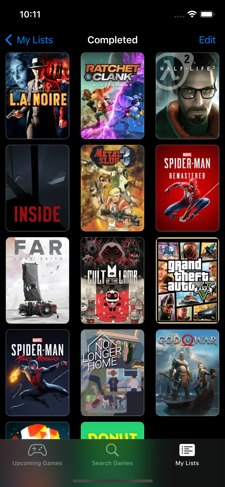

# Game Listing App

[]()
[](https://developer.apple.com/swift/)

- This is a game listing app similar to IMDb or Letterboxd but for video games.
- This app has been written with `UIkit` using [IGDB API](https://www.igdb.com/api) and utilizes `MVVM architecture`
- All UI elements are created programmatically. No storyboard is used.

### Technologies and Libraries
- MVVM
- Alamofire
- Kingfisher

## Screenshots

### Dark Mode

 
 
 
 

### Light Mode

 
 

## How to run

### Getting Started

1. Clone this repository.
   ```sh
   git clone https://github.com/SonmezYigithan/GameListingApp-iOS.git
   ```
2. navigate to the root folder of the project where Podfile is located and run.
   ```sh
   pod install
   ```
3. Open the workspace file.

### Create API Keys

1. Create IGDB account by following this [link](https://api-docs.igdb.com/#account-creation)
2. Generate access token with your Client ID and Client Secret [(more info)](https://api-docs.igdb.com/#authentication) (You may use this [Postman example](https://www.postman.com/descent-module-saganist-58166226/workspace/igdb-game-listing-app/request/25876325-35210f2c-9366-4693-8cf9-446287e09f3b?tab=params) for generate your access token)
3. Create a new API-Keys.plist using API-Keys-Template.plist and fill empty key values.
   ```
    IGDB_CLIENT_ID = YOUR_CLIENT_ID
    IGDB_AUTHORIZATION = YOUR_ACCESS_TOKEN
   ```

